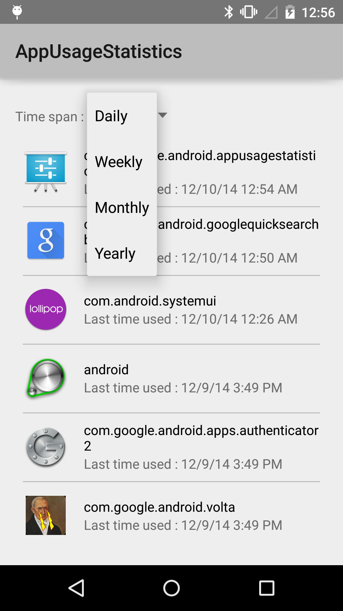
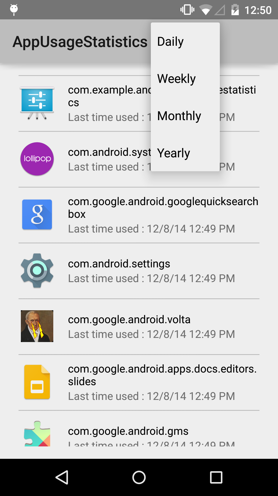

Android AppUsageStatistics Sample
===================================

A basic app showing how to use App usage statistics API to let users collect statistics related
to usage of the applications.

Introduction
------------

The [App usage statistics][1] API allows app developers to collect statistics related to usage of
the applications. This API provides more detailed usage information than the deprecated
[getRecentTasks()][2] method.

This example illustrates how to use the App usage statistics API by showing the applications sorted
by the timestamp of the last time each app was used.

To use this API, you must first declare the `android.permission.PACKAGE_USAGE_STATS` permission
in your manifest. The user must also enable access for this app through
`Settings > Security > Apps with usage access`.

To collect the statistics of the app usage, you need to first get the instance of
[UsageStatsManager][3] by the following code:

```java
mUsageStatsManager = (UsageStatsManager) getActivity()
       .getSystemService(Context.USAGE_STATS_SERVICE);
```

Then you can retrieve the statistics of the app usage by the following method:

```java
Calendar cal = Calendar.getInstance();
cal.add(Calendar.YEAR, -1);
List<UsageStats> queryUsageStats = mUsageStatsManager
        .queryUsageStats(UsageStatsManager.INTERVAL_DAILY, cal.getTimeInMillis(),
                System.currentTimeMillis());
```

The first argument of the [queryUsageStats()][4] is used for the time interval by which the
stats are aggregated. The second and the third arguments are used for specifying the beginning
and the end of the range of the stats to include in the results.

[1]: https://developer.android.com/reference/android/app/usage/package-summary.html
[2]: https://developer.android.com/reference/android/app/ActivityManager.html#getRecentTasks(int%2C%20int)
[3]: https://developer.android.com/reference/android/app/usage/UsageStatsManager.html
[4]: https://developer.android.com/reference/android/app/usage/UsageStatsManager.html#queryUsageStats(int%2C%20long%2C%20long)

Pre-requisites
--------------

- Android SDK 24
- Android Build Tools v24.0.1
- Android Support Repository

Screenshots
-------------

  

Getting Started
---------------

This sample uses the Gradle build system. To build this project, use the
"gradlew build" command or use "Import Project" in Android Studio.

Support
-------

- Google+ Community: https://plus.google.com/communities/105153134372062985968
- Stack Overflow: http://stackoverflow.com/questions/tagged/android

If you've found an error in this sample, please file an issue:
https://github.com/googlesamples/android-AppUsageStatistics

Patches are encouraged, and may be submitted by forking this project and
submitting a pull request through GitHub. Please see CONTRIBUTING.md for more details.

License
-------

Copyright 2016 The Android Open Source Project, Inc.

Licensed to the Apache Software Foundation (ASF) under one or more contributor
license agreements.  See the NOTICE file distributed with this work for
additional information regarding copyright ownership.  The ASF licenses this
file to you under the Apache License, Version 2.0 (the "License"); you may not
use this file except in compliance with the License.  You may obtain a copy of
the License at

http://www.apache.org/licenses/LICENSE-2.0

Unless required by applicable law or agreed to in writing, software
distributed under the License is distributed on an "AS IS" BASIS, WITHOUT
WARRANTIES OR CONDITIONS OF ANY KIND, either express or implied.  See the
License for the specific language governing permissions and limitations under
the License.
